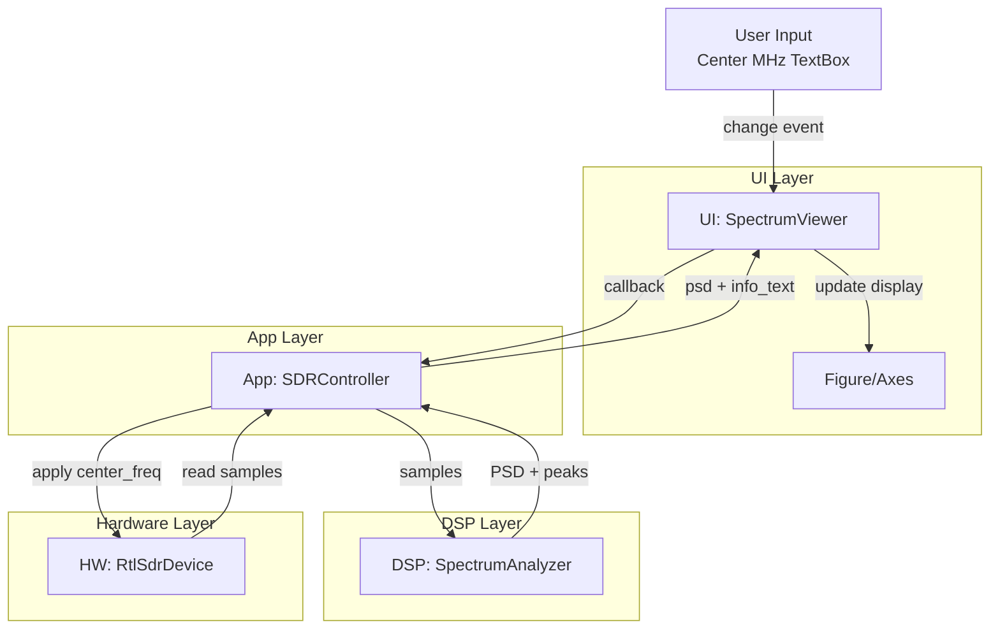
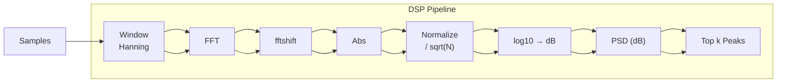

# TempestSDR_new

```mermaid
flowchart TD
  A["User Input<br/>Center MHz TextBox"] -->|change event| B["UI: SpectrumViewer"]
  B -->|callback| C["App: SDRController"]
  C -->|apply center_freq| D["HW: RtlSdrDevice"]
  D -->|read samples| C
  C -->|samples| E["DSP: SpectrumAnalyzer"]
  E -->|PSD + peaks| C
  C -->|psd + info_text| B
  B -->|update display| F["Figure/Axes"]

  subgraph "UI Layer"
    B
    F
  end
  subgraph "App Layer"
    C
  end
  subgraph "DSP Layer"
    E
  end
  subgraph "Hardware Layer"
    D
  end
```

```mermaid
flowchart LR
  S["Samples"] --> W["Window<br/>Hanning"]
  W --> F["FFT"]
  F --> SH["fftshift"]
  SH --> A["Abs"]
  A --> N["Normalize<br/>/ sqrt(N)"]
  N --> L["log10 → dB"]
  L --> PSD["PSD (dB)"]
  PSD --> P["Top k Peaks"]

  subgraph "DSP Pipeline"
    W --> F --> SH --> A --> N --> L --> PSD --> P
  end
```