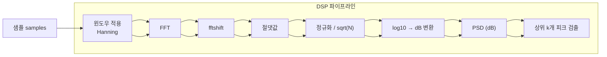

# TempestSDR_new

```mermaid
flowchart TD
  A["사용자 입력\nCenter MHz TextBox"] -->|변경 이벤트| B["UI: SpectrumViewer"]
  B -->|콜백| C["App: SDRController"]
  C -->|center_freq 적용| D["HW: RtlSdrDevice"]
  D -->|read_samples(N)| C
  C -->|샘플 전달| E["DSP: SpectrumAnalyzer"]
  E -->|PSD 계산·피크 검출| C
  C -->|psd + info_text| B
  B -->|화면 업데이트| F["Figure/Axes"]

  subgraph "UI 계층"
    B
    F
  end
  subgraph "App 계층"
    C
  end
  subgraph "DSP 계층"
    E
  end
  subgraph "Hardware 계층"
    D
  end
```

